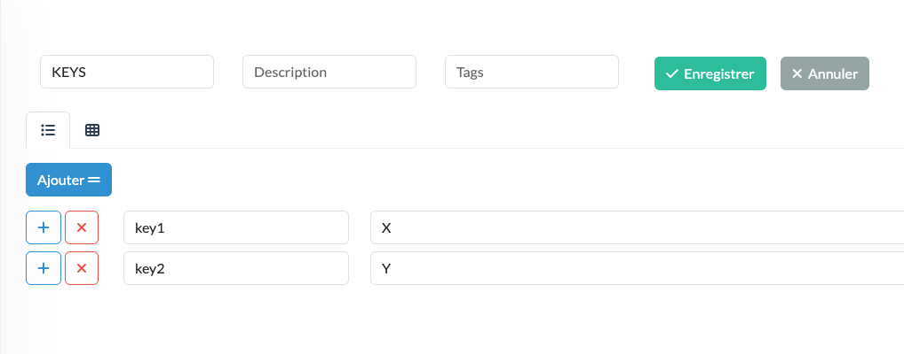
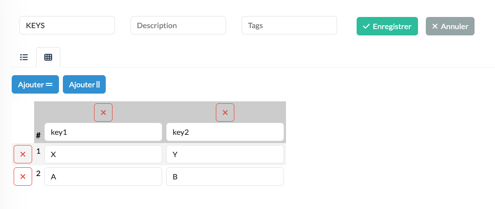
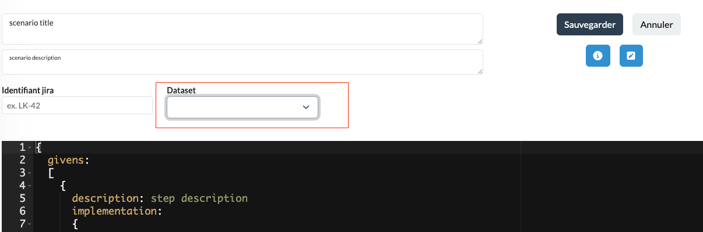
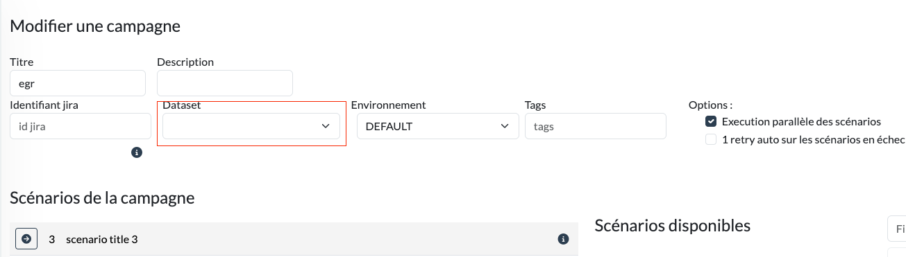

<!--
  ~ SPDX-FileCopyrightText: 2017-2024 Enedis
  ~
  ~ SPDX-License-Identifier: Apache-2.0
  ~
-->

Dataset values will be available in the **execution context**.

A dataset contains :  
* Constants (`Map<String,String>`) which are a map of key/value.  
* Datatable(`List<Map<String,String>>`) which is a list of maps of key/value. Datatable is a matrix with list elements as rows and map keys as columns.  

# Declaration

=== "Kotlin"
    ### Constant dataset

    ``` kotlin
    val constants = mapOf(
            "key1" to "X",
            "key2" to "Y"
        )
    ```
    
    ### Array dataset
    ``` kotlin
    val datatable = listOf(
        mapOf(
            "key1" to "X",
            "key2" to "Y"
        ),
        mapOf(
            "key1" to "A",
            "key2" to "B"
        )
    )
    ```

=== "UI"
    In (`Dataset` menu)
    
    ### Constant dataset  
    In `Dataset` menu:  
    
    
    ### Array dataset
    

# Usage
=== "Kotlin"
    ### Constant dataset
    
    The code below show how to use constants in your scenario with `ForStrategy` to iterate once over these constants.
    
    ``` kotlin
    val scenario = Scenario(title = "scenario with for over constants") {
        When("<i> step description - \${#key1} - \${#key2}", strategy = ForStrategy()) {
            SuccessAction(
            )
        }
    }
    val executionService = ExecutionService()
    executionService.execute(scenario, constants = constants)
    
    ```
    
    ### Array dataset
    
    To use an array dataset you need to iterate over it with the `ForStrategy` as below:
    
    ``` kotlin
    
    val scenario = Scenario(title = "scenario with for") {
        When("<i> step description - \${#key1} - \${#key2}", strategy = ForStrategy()) {
            SuccessAction(
            )
        }
    }
    val executionService = ExecutionService()
    executionService.execute(scenario, dataset = dataset)
    ```
    In this example the step `When` of the scenario will be executed `2` times (because `dataset.size == 2`).  
    The variable `< i >` will be replaced by the iteration (the row index here) and `\${#key1}` `\${#key2}` will be replaced by the content of the row.

=== "UI"
    ### Link dataset to a scenario
    
    In scenario edition page:
    
    
    ### Link dataset to a campaign
    
    In campaign edition page:
    
