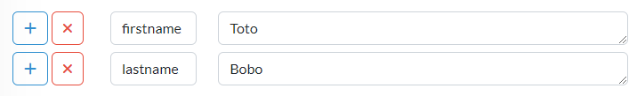

In order to write a scenario, you also need to declare environments and services you want to test.

# Define your test environment

## Declare a target

Under `src/main/kotlin` create a package (ex. `com.chutneytesting.getstart`) and create a Kotlin file (ex. `Environments.kt`) with the following content :

``` kotlin title="Environments.kt"
package com.chutneytesting.getstart

import com.chutneytesting.kotlin.dsl.ChutneyTarget

val google = ChutneyTarget(
        name = "search_engine",
        url = "https://www.google.fr"
)
```

* The target name `search_engine` is used as a reference in your scenarios
* The `google` variable is a reference to set a target in an `environment`

## Declare an environment

Now you can declare an `environment` within the same file, add the following content :

``` kotlin title="Environments.kt"
val environment = ChutneyEnvironment(
        name = "The World Wide Web",
        description = "The World Wide Web",
        targets = listOf(
                google
        )
)
```

* We reference the target `google` using the variable name.
* The environment `name` and `description` can be anything meaningful to you. The name will be shown in the execution report.
* The variable name `environment` is a reference to set the environment on running tests

# Define your test environment (alternative)

There is another way to declare environments and targets by using JSON files.

Create a folder `.chutney/environments` in your project root folder.  
Then, create a file `environment.json` with the following content :

``` json
{
    "name" : "World Wide Web",
    "description" : "The World Wide Web",
    "targets": [
        {
            "name" : "search_engine",
            "url" : "https://www.google.fr"
        }
    ]
}
```
!!! tip "An environment is already defined on your Chutney server?"
    If you have already defined an environment on your Chutney server, you can import it by calling `synchroniseLocal` function of `EnvironmentSynchronizeService`:
    
    ``` kotlin
        import EnvironmentSynchronizeService
        import com.chutneytesting.kotlin.util.ChutneyServerInfo
        
        fun main() {
            val chutneyLocalServer = ChutneyServerInfo(
                remoteServerUrl = "https://localhost:8081",
                remoteUserName = "admin",
                remoteUserPassword = "admin"
            )

            val environmentSynchronizeService = EnvironmentSynchronizeService()
    
            environmentSynchronizeService.synchroniseLocal(serverInfo = chutneyLocalServer)
       }
    ```
    `synchroniseLocal` function parameters:

    | name               | type                       | Required  | default                 |          description                                     |
    |:-------------------|:---------------------------|:---------:|:------------------------|:---------------------------------------------------------|
    | `serverInfo`       | `ChutneyServerInfo`        |     *     |                         | holds needed information to connect to chutney server   |
    | `environmentsPath` | `String`                   |           | `.chutney/environments` | where to save the imported environments                  |
    | `force`            | `Boolean`                  |           | `false`                 | if true, locally existing environments files will be overridden.</br>Else they will be kept unchanged |


# Declare dataset

You can create a dataset and use it in your scenarios.
When you declare a dataset, you will provide a name, a description and a tag.
The name will be the identifier to use in your scenarios

There are 2 types of dataset :
* Constant dataset which is a set of pairs key/value.
* Array dataset which is composed by headers and a set of rows.


## Constant dataset

The code below show how to use constants in your scenario

``` kotlin
data class Dataset(
    val firstname: String,
    val lastname: String
)

@Scenario
fun test() = withData(
    Dataset(
        firstname = "firstname".spEL(),
        lastname = "lastname".spEL()
    )
)
{
    Scenario(title = "scenario with constants") {
        Given {
            ContextPutAction(
                mapOf(
                    "firstname" to it.firstname,
                    "lastname" to it.lastname
                )
            )
        }
        When("step description") {
            SuccessAction(
            )
        }
    }
}
```
In this example the "withData" will be useful to declare the template of the dataset (defined in the data class CustomerDataset ) in your Kotlin code. The "ContextPutAction" allow you to add your constants in the context of your scenario

Now you can declare constants like this in the dataset panel of the IHM



The last step is to link the dataset and execute the scenario with your values


## Array dataset

To use an array dataset you need to iterate over it with the "for strategy" of the code below

``` kotlin
fun <T> withData(vararg elements: T, transform: (T) -> ChutneyScenario): List<ChutneyScenario> =
    if (elements.size > 0) elements.asList().map { transform.invoke(it) } else emptyList()

data class CustomerDataset (
    val firstname: String,
    val lastname: String
)

@Scenario
fun test() = withData(
    CustomerData(
        firstname = "firstname".spEL(),
        lastname = "lastname".spEL()
    )
)
{
    Scenario(title = "scenario with for strategy") {
        When("<i> step description - \${#firstname} - \${#lastname}", strategy = ForStrategy()) {
            SuccessAction(
            )
        }
    }
}
```

In this example the step 'When' of the scenario will be executed X times with X the number of row in the dataset.
The variable "< i >" will be replaced by the iteration (the column index here) and "\${#firstname}" \${#lastname}" will be replaced by the content of the row


Now let's create an array dataset in your IHM Chutney and link it with the scenario :

```
| firstname     | lastname     |
|:--------------|:-------------|
| `Toto`        | `Bobo`       |
| `Tutu`        | `Bubu`       |
| `Tata`        | `Baba`       |
```
If we start the execution


Warning - only one strategy can be applied per action. If needed, you can add intermediate steps with a strategy


# Write a scenario

Under `src/main/kotlin`, in the same package or another, create a Kotlin file (ex. `Scenarios.kt`) with the following content :

``` kotlin title="Scenarios.kt"
package com.chutneytesting.getstart

import com.chutneytesting.kotlin.dsl.HttpGetAction
import com.chutneytesting.kotlin.dsl.Scenario
import com.chutneytesting.kotlin.dsl.SuccessAction
import com.chutneytesting.kotlin.dsl.spEL

val search_scenario = Scenario(title = "Search documents") {
    When("I visit a search engine") {
        HttpGetAction(
                target = "search_engine",
                uri = "/",
                validations = mapOf("request accepted" to "status == 200".spEL())
        )
    }
    Then("I am on the front page") {
        SuccessAction()
    }
}
```

* The scenario title `Search documents` will be shown in the execution report.
* There are 2 steps `When I visit a search engine` and `Then I am on the front page`
* The first step will execute an HTTP GET call on the target name `search_engine` on the uri `/`
    * It also has one [validation](/documentation/actions/#validation) `request accepted` to check the response code status is 200.
* The second step does nothing meaningful in this example

!!! tip "Et voilà !"
    You have successfully setup and written your first scenario using Chutney.  
    Now, you will see how to [run it ! :material-rocket-launch:](/getting_started/run "🏃")
